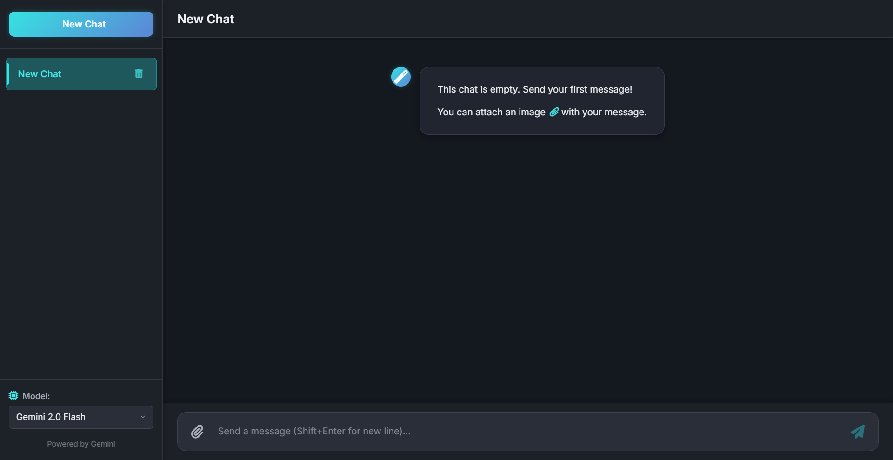
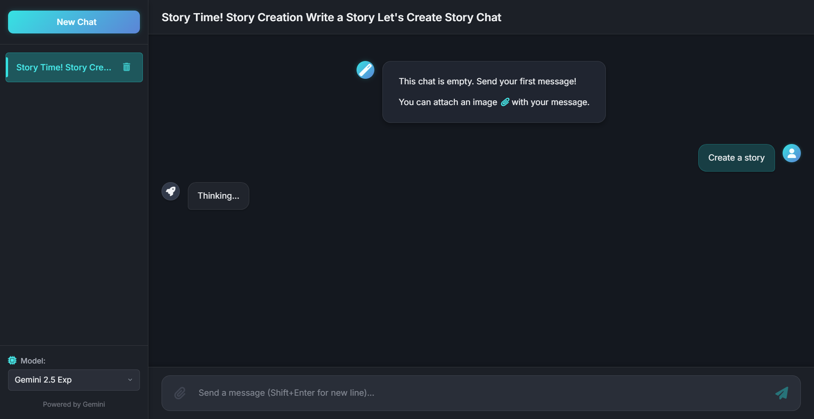
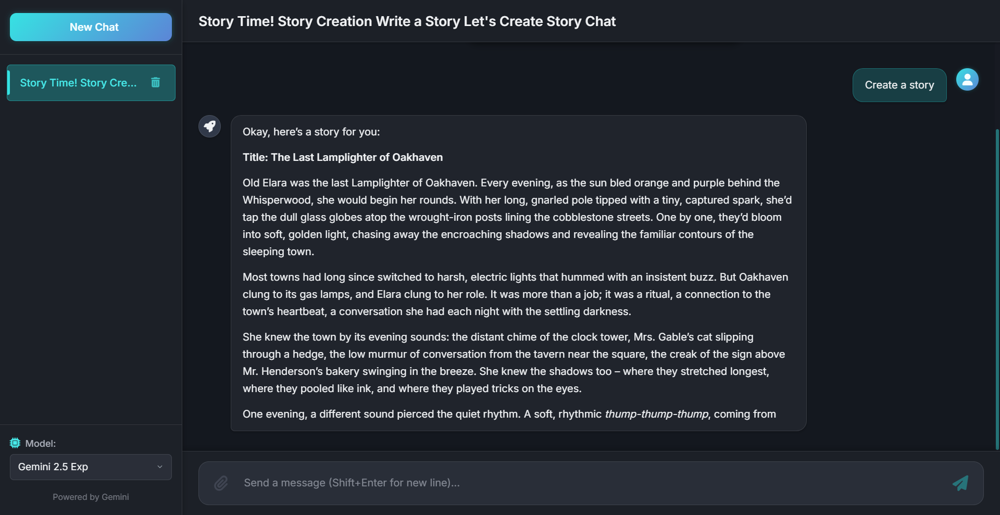

# 🌌 Zenith Chat

**Hyperion Chat** is a blazing-fast, serverless, no-auth AI chat app powered by Gemini models. It supports rich markdown formatting, syntax highlighting, image uploads, and even generates dynamic titles for each chat session. Everything is stored locally, ensuring privacy and speed.

> 🛠 Built with: `HTML`, `CSS`, `JavaScript`, `Cloudflare Workers`, and `Cloudflare Pages`.

## 🚀 Features

- ✨ **Supports multiple Gemini models:**
  - Gemini 2.0 Flash
  - Gemini 2.0 Flash-Lite
  - Gemini 2.5 Exp
  - Gemini 2.5 Flash Preview
  - Gemini 1.5 Flash-8B
  - Gemini 1.5 Flash
  - Gemini 1.5 Pro
- 🖼️ **Image upload support**
- 📝 **Markdown formatting** + `Syntax highlighting`
- 🧠 **Title generation** for chat threads
- ⚡ **Super fast**, serverless performance
- 🔐 **No authentication required**
- 🧠 **Local storage** persistence
- ❌ **Delete chats** anytime
- 📱 **Mobile-friendly UI**
- ☁️ **Deployed on Cloudflare Pages**
- 🔐 **API key stored securely using Wrangler secrets**

## 🌍 Live Demo

> [https://zenithchat.pages.dev](https://zenithchat.pages.dev)

## 🧑‍💻 Getting Started

### 1. Clone the repository

```bash
git clone https://github.com/KarthikSambhuR/ZenithChat.git
cd ZenithChat
```

### 2. Set up Wrangler and secrets

Install [Wrangler](https://developers.cloudflare.com/workers/wrangler/):

```bash
npm install -g wrangler
```

Authenticate and configure Wrangler:

```bash
wrangler login
```

Set your Gemini API key as a secret:

```bash
wrangler secret put GEMINI_API_KEY
```

### 3. Preview locally

```bash
wrangler pages dev
```

### 4. Deploy to Cloudflare Pages

```bash
wrangler pages publish . --project-name=ZenithChat
```

## 🧪 Tech Stack

- **Frontend:** HTML + CSS + JavaScript (Vanilla)
- **Backend:** Cloudflare Workers (for Gemini API calls)
- **Hosting:** Cloudflare Pages
- **Secrets Management:** Wrangler secrets

## 📸 UI Preview

Here’s a look at Zenith Chat in action:

<div align="center">
  <table>
    <tr>
      <td></td>
      <td></td>
      <td></td>
    </tr>
    <tr>
      <td align="center">UI</td>
      <td align="center">Thinking</td>
      <td align="center">Sample Prompt</td>
    </tr>  
    <tr>
      <td></td>
      <td></td>
    </tr>
    <tr>
      <td align="center">Syntax Highlighting</td>
      <td align="center">Syntax Highlighting</td>
    </tr>
  </table>
</div>

## 📄 License

MIT License

---
